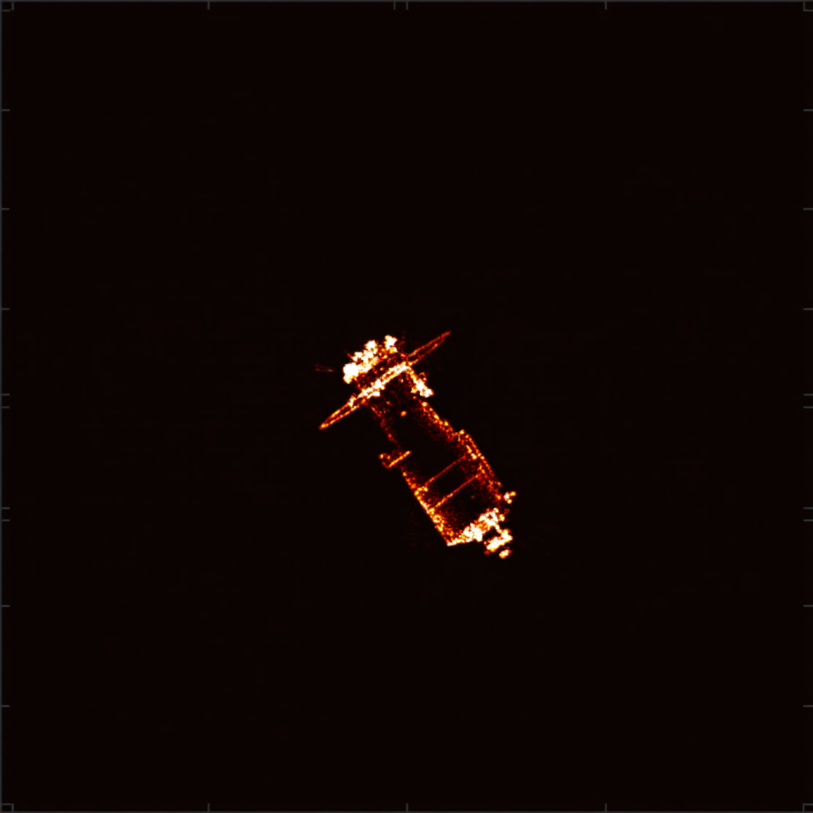
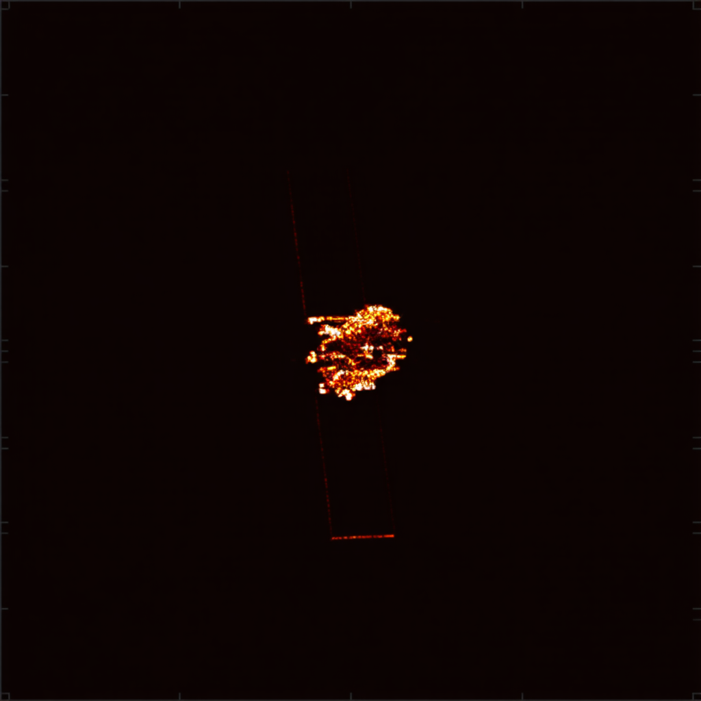
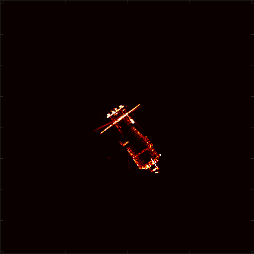

# 周报  

train_controlnet_sd3.py使用扩散模型里的这个训练脚本训练

用训练的控制图片和提示词作为输入进行生成

prompt = "A simulated ISAR radar image of a satellite target, elevation 7.090614e+00 degrees, azimuth -1.007496e+01 degrees, high contrast, black background."

生成图：

原图：

图片尺寸没有修正，然后生成的卫星可以根据位姿信息作为提示词来确定卫星的位姿。

目前训练的时候拿isar作为目标，拿散点强度和散点图作为控制，没有使用OP。目前不知道这个任务是否需要使用OP，

后续工作：

1.增加散点图和散点强度的控制模块，根据这两个控制条件去补全卫星。

2.目前训练出来的模型做推理任务时，同时需要输入提示词和控制图。如果补全卫星的模型效果好的话，打算蒸馏出一个只需要提示词输入的模型，这样做生成任务时只需要提供提示词即可。
