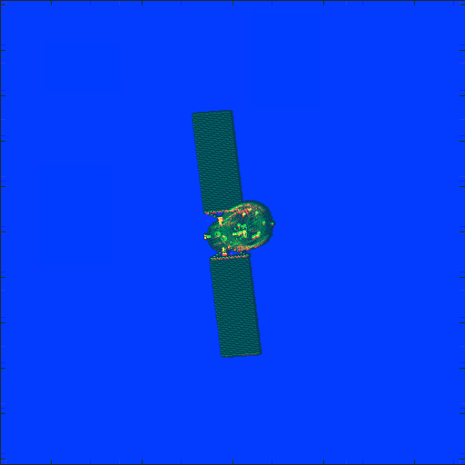
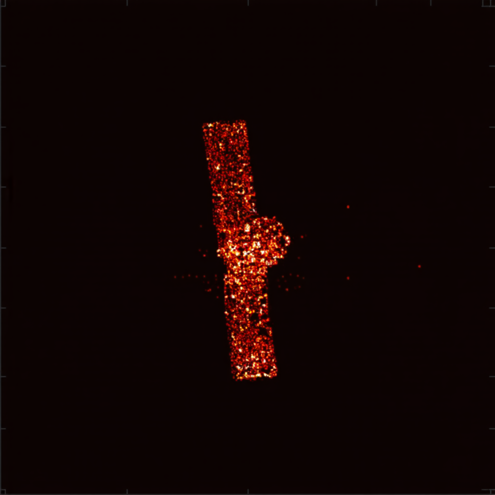
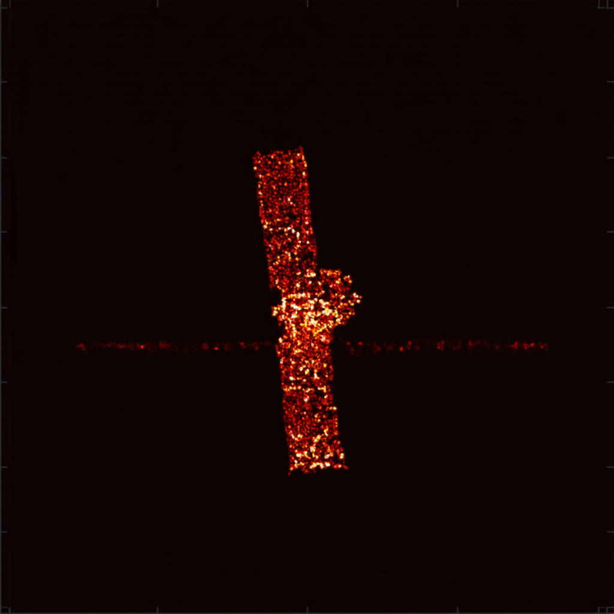
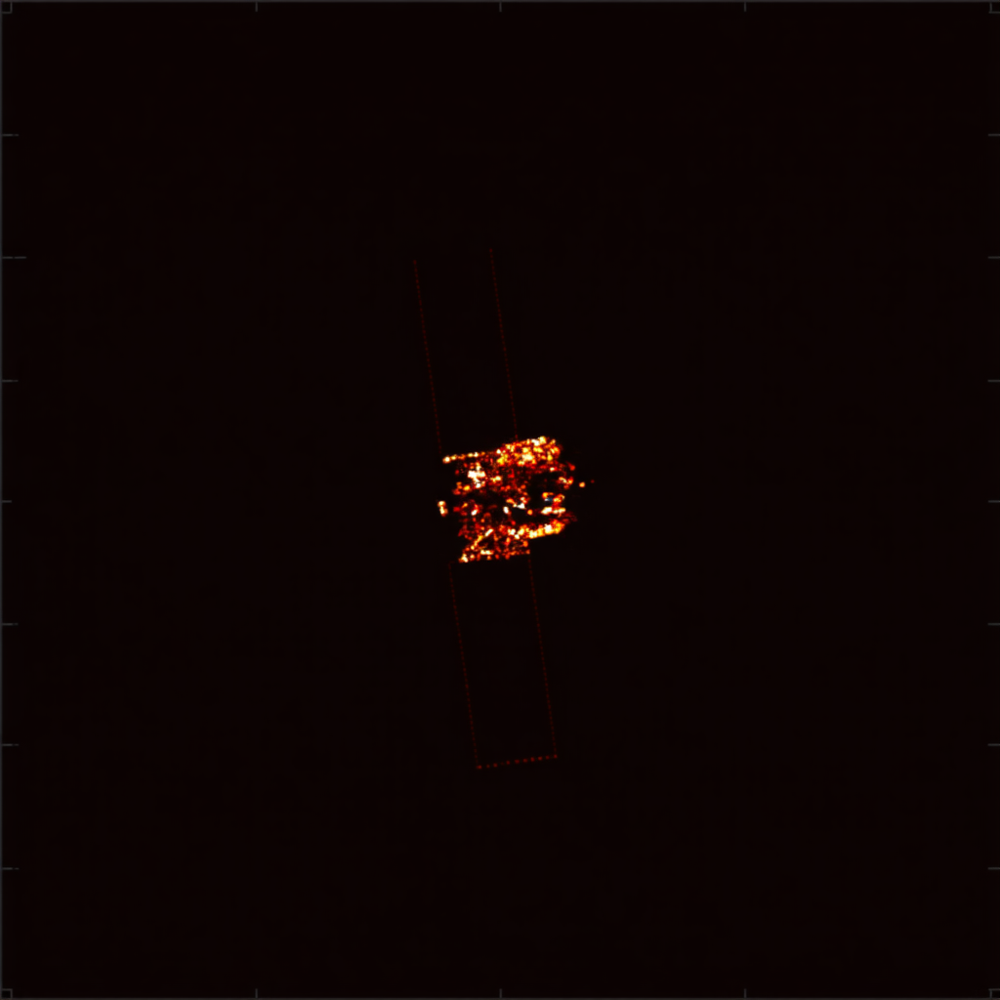

# 周报  

控制图

原图

目前加了一些三个机制，然后感觉补全补得太多了，颜色太重了，之后再优化。

机制一：自监督学习 —— “二次残缺法”。人为地对已经残缺的图像进行**二次破坏**，二次残缺后的图放入到控制图中。

机制二：散点图作为“几何包络约束”

机制三：散点强度作为“强散射中心聚焦” 

用训练集的prompt="Inpaint and complete the missing parts of a simulated ISAR radar image of a satellite target. Guided by sparse scatter points and intensity map. Generated via orthographic projection with a spatial resolution of 0.0800 units/pixel. Image horizontal U-axis direction in 3D space is (0.2503, -0.9606, -0.1209). Image vertical V-axis direction in 3D space is (-0.1142, 0.0948, -0.9889). High contrast, black background."

训练集中没有的向量prompt="Inpaint and complete the missing parts of a simulated ISAR radar image of a satellite target. Guided by sparse scatter points and intensity map. Generated via orthographic projection with a spatial resolution of 0.0800 units/pixel. Image horizontal U-axis direction in 3D space is (0.25, -0.96, -0.12). Image vertical V-axis direction in 3D space is (-0.11, 0.09, -0.98). High contrast, black background."

只有机制一：自监督学习 —— “二次残缺法”。人为地对已经残缺的图像进行**二次破坏**，二次残缺后的图放入到控制图中。

后续打算先弄类似于蒸馏的方法，看看能不能实现只用文本输入来生成图片。这样就可以确保输入不同的向量，生成不同位姿的卫星。

打算先把整个方案跑通之后再进行优化。

有一个问题，散点强度图的各个颜色意义不是很明确，有哪几个强度级别？每个颜色代表了什么？之后打算针对散点图和散点强度图的细节进行优化。

未来的工作，比如坐标向量的单位，考虑正则化；生成图像的分辨率、输入图像的分辨率和坐标向量单位的关系；确定(0,0,0)坐标向量的基准姿态等这些细节上的东西等方案跑通了再去调整。
