# SAR 目标感知与动态关联认知研究

---

## 一、汇报核心结论

SAR 已成为大范围、长时序监测的重要手段，应用场景覆盖军事侦察、应急救援、国土资源、环保水利、灾害监测和地形测绘等方向。当前研究重点正在从传统分割、检测和分类，进一步发展到**长时序关联理解与群体行为认知**。

汇报中的研究工作主要包括三条主线：

1. **分布式目标精细检测**：以冰面湖为代表，利用双极化 SAR 数据、散射机理建模和遥感基础模型，提高复杂高山区冰面湖检测精度。
2. **关键目标精细检测**：以舰船、飞机为代表，针对 SAR 目标特征离散、纹理模糊、表征不完整等问题，构建拓扑潜在特征、强散射点和散射中心标签分配方法。
3. **目标动态关联认知**：面向多目标、多源、长时序场景，通过动态超图网络刻画目标间关系，实现群体关系识别、行为分析和任务支撑。

---

## 二、研究背景：SAR 已成为长时序对地观测的重要手段

SAR 具备全天时、全天候、大范围观测能力，在自然背景和复杂地物场景中可以持续获取目标散射信息。汇报中指出，SAR 对地观测已经成为大范围、长时序监测的重要技术路径。

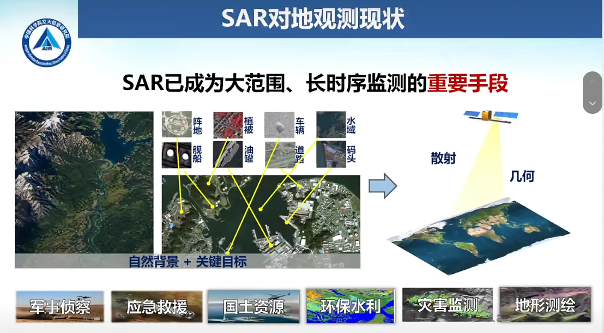

从发展趋势看，SAR 目标感知经历了从传统机器学习到深度学习，再到 SAR 基础模型的发展过程。能力边界也从较粗分辨率下的分割、检测、识别，逐步走向更高层次的**关联理解**。

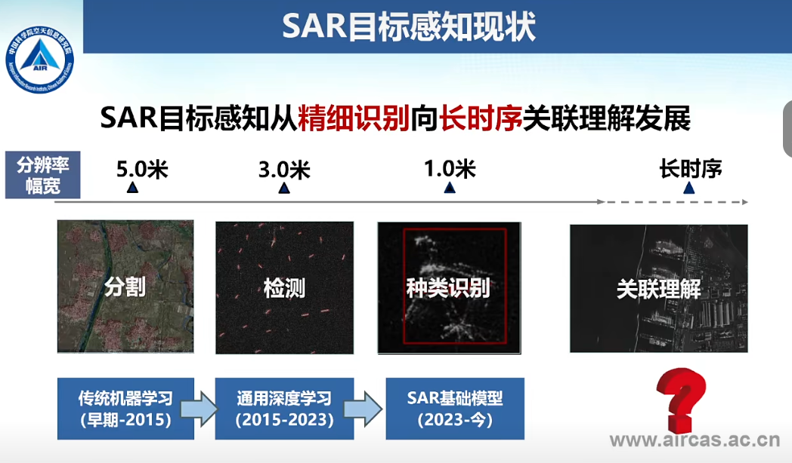

---

## 三、主要问题与挑战

汇报将当前 SAR 目标认知难点归纳为三个层次：

| 层次 | 问题 | 具体表现 |
|---|---|---|
| 目标特性表征 | **散射特征“学不全”** | SAR 散射机理复杂，受地形起伏、阴影遮挡、时相不完备等影响，目标散射特征难以充分表征。 |
| 目标精细感知 | **复杂目标“看不清”** | 分布式地物边界模糊，关键目标尺度小、特征弱，存在易漏检、易误检问题。 |
| 时空关系认知 | **群体关系“看不懂”** | 时序数据不足，难以支撑关系理解、群体行为分析和动态演化认知。 |

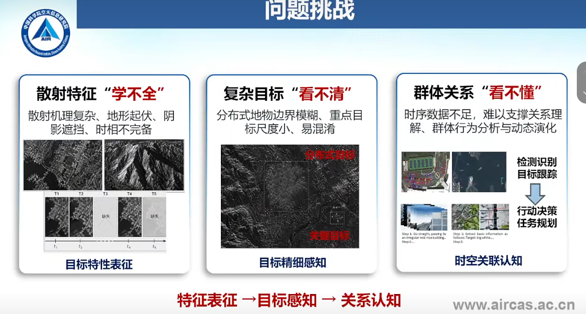

因此，整体技术路线可以概括为：  
**特征表征 → 目标感知 → 关系认知**。

---

## 四、研究定位与研究对象

### 4.1 研究定位

研究面向复杂背景下的目标全局动态关联认知，基于 SAR 散射特性与图像特征，围绕分布式地物与关键目标，开展地物精细识别和目标动态关联认知方法研究。

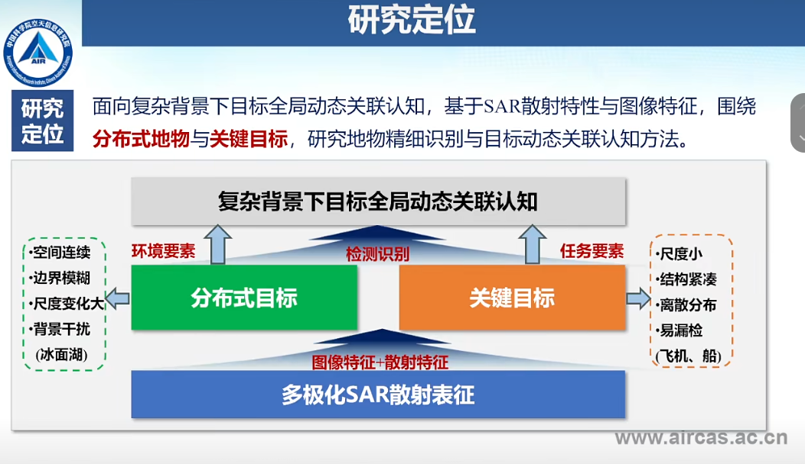

### 4.2 研究对象

研究对象分为两类：

- **分布式地物代表：冰面湖**  
  其特点是形态各异、分布范围广、面积大小不一，容易受到湿度、几何特性、粗糙度、地形等敏感相似地物干扰。
- **关键目标代表：飞机、船舶**  
  其特点是目标尺寸小、散射特征离散，存在密集分布、遮挡、虚警、漏检和人工判读依赖强等问题。

---

## 五、技术路线一：分布式目标精细检测

### 5.1 双极化数据建模与极化特征增强

针对冰面湖等分布式目标，研究通过建模双极化数据的表面散射与体散射机制，定量描述冰面地物流融状态，实现极化特征增强，为后续模型提供物理可解释特征。

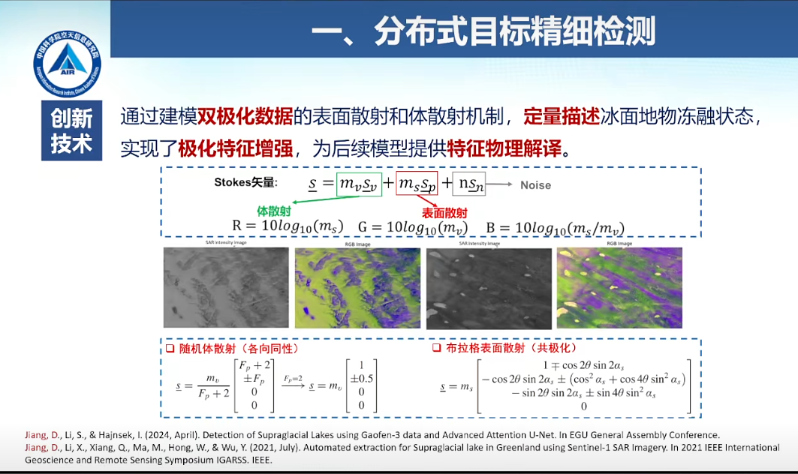

### 5.2 遥感基础模型驱动的小样本检测框架

汇报中构建了基于遥感基础模型的目标检测框架，支持小样本数据训练，显著提升复杂地表环境下对碎片化、低对比度、小尺度目标的识别能力。该框架融合了 CNN 的局部特征提取能力和 ViT 的全局上下文建模能力，并通过多源数据兼容处理、通道级自适应权重分配、小样本迁移学习和混合特征提取进一步增强泛化能力。

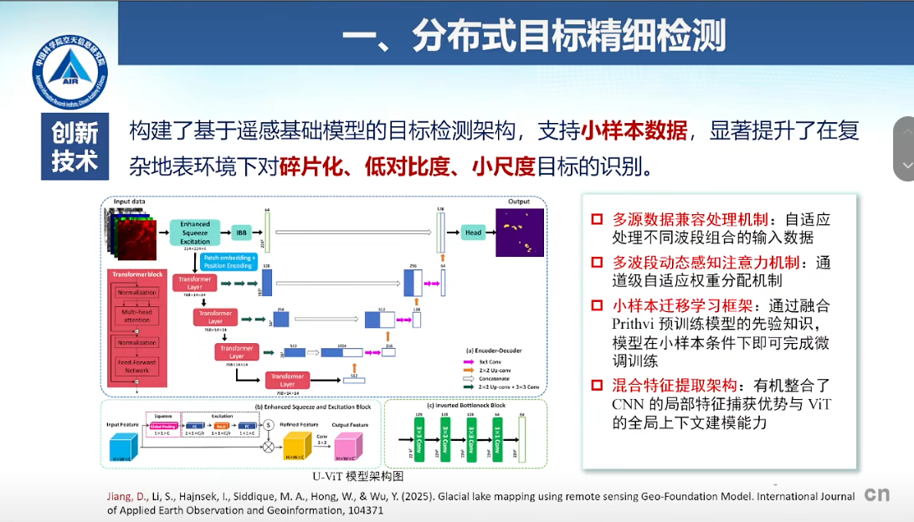

### 5.3 应用成果：冰面湖检测与长时序产品

在高山区复杂地形环境下，冰面湖检测的 **F1 达到 0.89**。同时，形成了 **2017—2022 年每月冰面湖制图产品**，可用于支撑冰面湖长期变化监测、异常事件识别和气候响应分析。

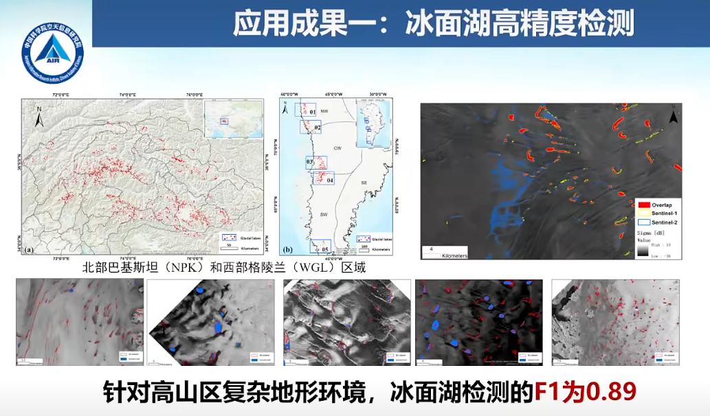

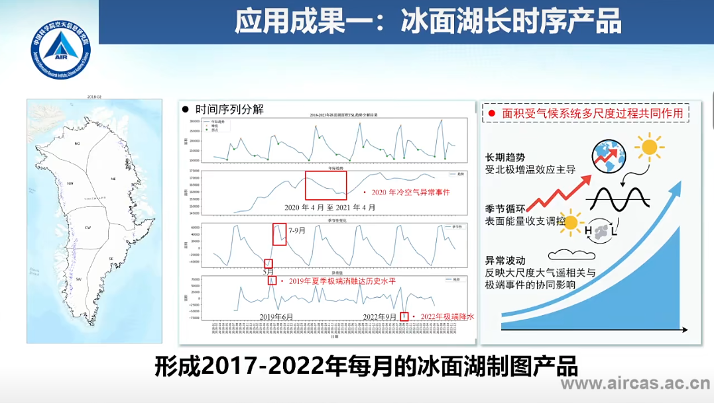

---

## 六、技术路线二：关键目标精细检测

针对舰船、飞机等关键目标，研究面向 SAR 目标特征离散、纹理模糊、缺乏完整表征的问题，提出基于拓扑信息的潜在特征提取方法，构建稳健散射特征，引导模型优化，提高 SAR 目标检测能力。

关键技术包括：

- **拓扑潜在特征提取**：利用拓扑结构描述目标局部与整体关系。
- **强散射点提取**：增强对关键散射结构的捕捉能力。
- **细节捕捉 + 散射特征牵引 + 散射中心标签分配**：提升小目标、弱目标、密集目标场景下的检测稳定性。

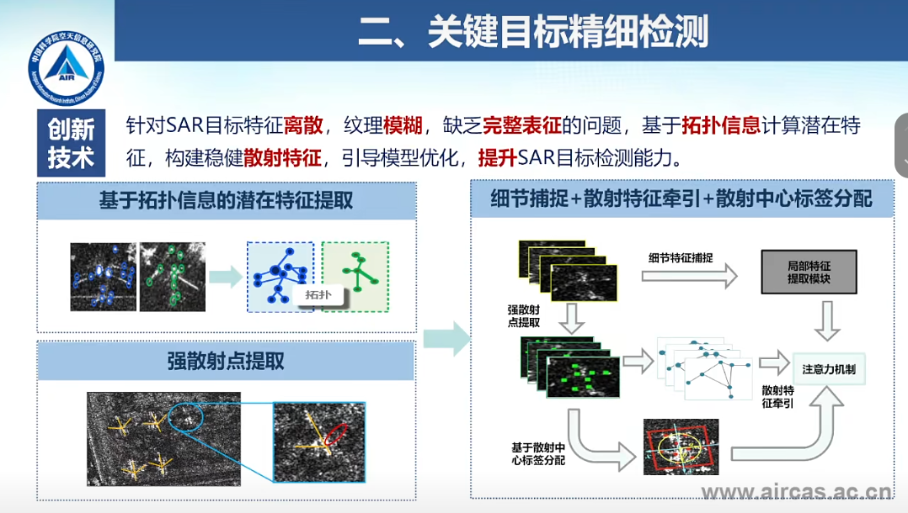

### 6.1 舰船目标检测成果

在舰船检测任务中，汇报展示了散装货船、油船、作业船等多类舰船目标检测效果。结果显示：

- 重点港口平均检测精度优于 **95%**；
- 虚警率小于 **22%**；
- 覆盖 **20 余型舰船检测**；
- 虚警率平均降低近 **30%**。

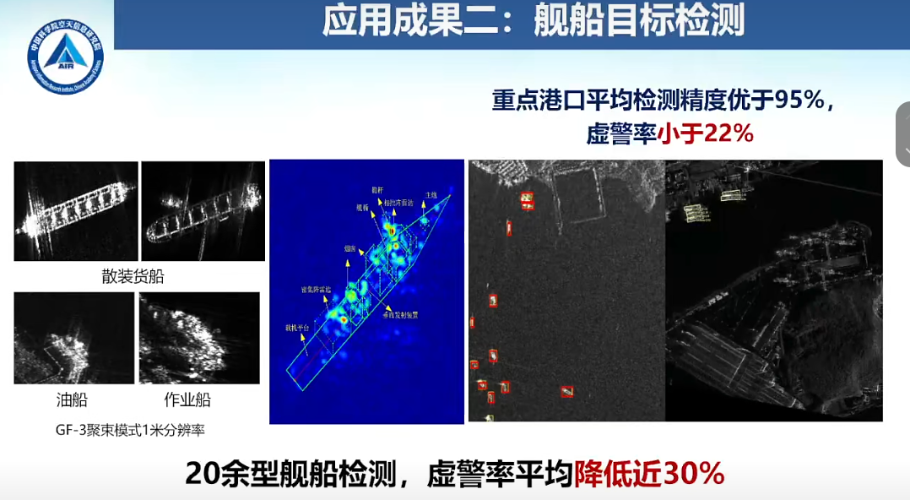

### 6.2 飞机目标检测成果

在飞机检测任务中，研究实现了近二十型飞机的型号精细识别，包括 A220、A330 等 6 类民用飞机和 14 类其他机型。结果显示，飞机目标检测与识别的 **F1 精度超过 84.8%**。

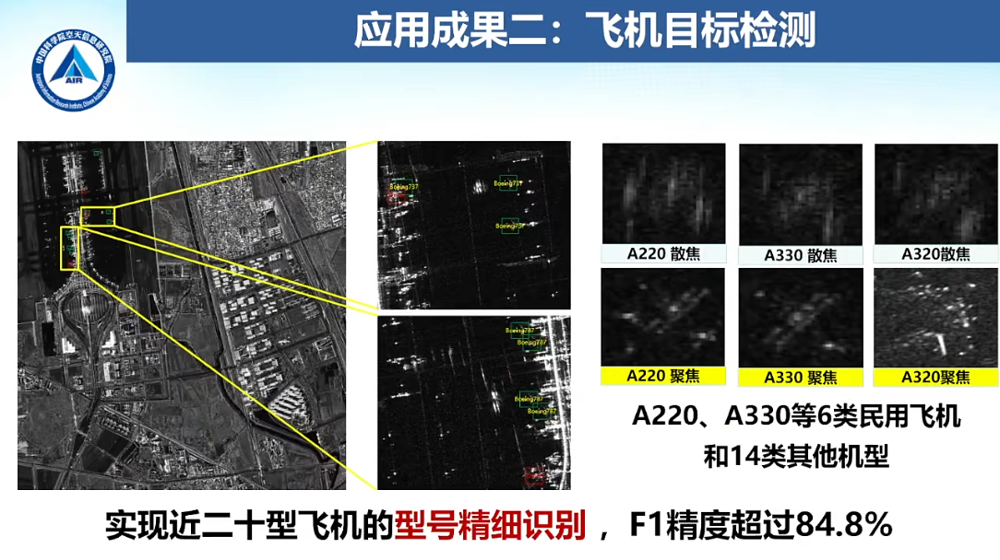

---

## 七、技术路线三：目标动态关联认知

在复杂时空场景中，单帧目标检测和识别难以支撑群体关系理解。汇报进一步引入长时序多源观测数据，并结合动态超图网络，实现目标群体关系的连续识别与可解释分析。

该部分的核心思想是：  
以“群”为最小关系单元，对识别结果中的多目标共现关系与复杂任务依赖进行统一表征，在时空动态场景下实现更具泛化性、鲁棒性和可解释性的群体划分。

关键步骤包括：

1. 提取身份特征、时向特征、运动特征、交互特征、空间特征和能力特征；
2. 基于共现关系与任务类型建立超边；
3. 构建目标关系超图并进行群组划分；
4. 通过跨时窗对齐分析关系演化；
5. 支撑交通监管、海上搜救、航线交汇和运行避让等应用。

汇报中给出的结果为：在目标关联挖掘海空数据上达到 **85.0% 以上准确率**。

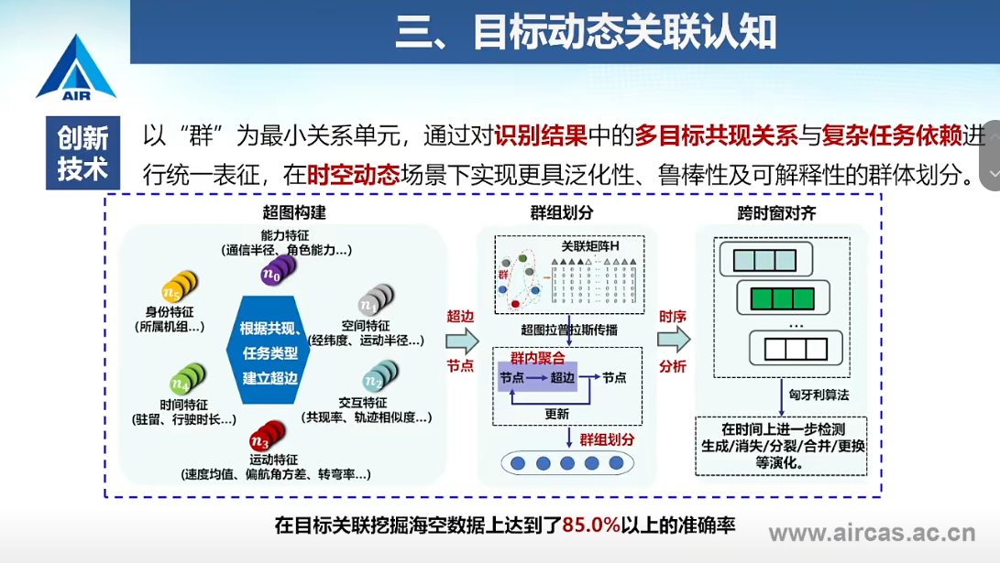

---

## 八、阶段性成果总结

| 方向 | 技术贡献 | 汇报中展示的结果 |
|---|---|---|
| 极化与散射特征增强 | 双极化分解、散射机理建模、特征物理解释 | 支撑分布式地物检测与识别 |
| 分布式目标检测 | 基础模型 + 小样本迁移 + 混合特征提取 | 冰面湖检测 F1 = 0.89；形成 2017—2022 年月尺度产品 |
| 舰船目标检测 | 拓扑潜在特征、强散射点、散射中心标签分配 | 港口平均精度 >95%；虚警率 <22%；虚警率平均降低近 30% |
| 飞机目标检测 | 民航飞机与其他机型细粒度识别 | 近二十型飞机识别，F1 >84.8% |
| 动态关联认知 | 多源数据融合 + 动态超图网络 | 海空目标关联挖掘准确率 >85% |

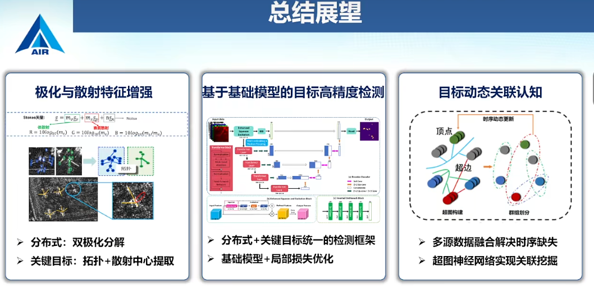

