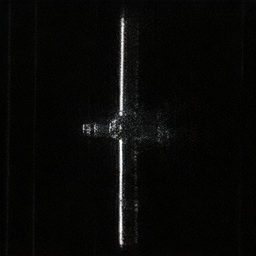
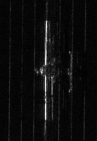
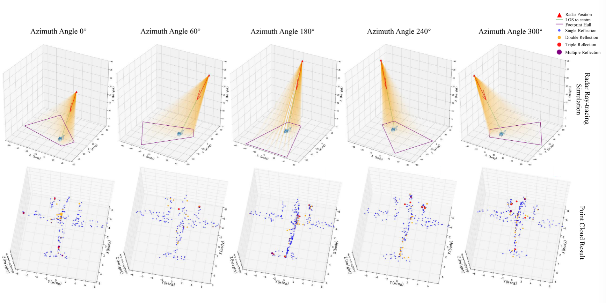

# 周报  

## GeoDiff-SAR：一种用于SAR图像生成的几何先验引导扩散模型

跑了这个论文的开源代码，作者在项目里留了十份数据，训练100轮，重复学习20次。3d特征使用.pt .npz,  .npy文件。

推理的时候使用提示词和点云。

prompt "qinglong, aircraft, military, side view"

pointcloud_path ./3d_features/1.pt

这个是生成的图片

这个是使用的数据集图片

需要多看看代码，有很多参数需要设置，作者也修改了大量代码。目前只使用作者推荐的参数设置进行训练和推理。

后续看看在我们的数据集上效果怎么样，再读一下论文，看看作者修改了哪些部分。

对于这个多次反射：通过模拟雷达电磁波与 3D 目标模型之间的物理交互，提取出带有强度和反射类型信息的“伪 SAR 点云”，并以此作为引导生成模型 SD3的几何骨架。

**单次反射 (Single Reflection)：** 电磁波打在目标表面（如机身侧面或机翼顶部）后直接弹回雷达接收机。通常情况下，除非该表面完全垂直于雷达视距（形成镜面反射），否则大量的电磁波能量会被散射到其他方向，导致雷达接收到的单次反射回波能量相对较弱 。

**二次与多次反射 (Double / Multiple Reflections) —— 核心高亮区：** 这是实际 SAR 图像中**高强度（亮斑）像素的主要来源** 。当雷达波打在机翼与机身交界处（形成二面角反射器，Dihedral corner reflector）或尾翼等复杂结构（三面角，Trihedral）时，电磁波会在两个或三个面之间发生连续弹射。这种结构会导致电磁波最终几乎沿着原路极其强烈地返回雷达 。
