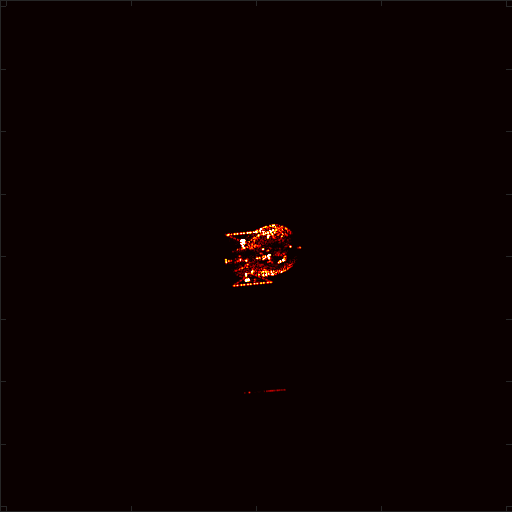
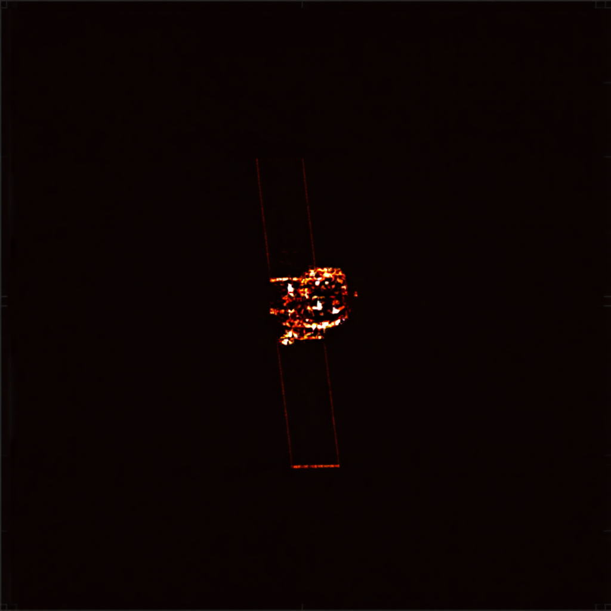
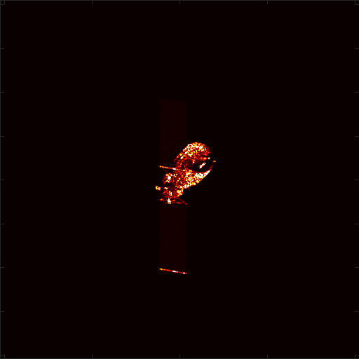
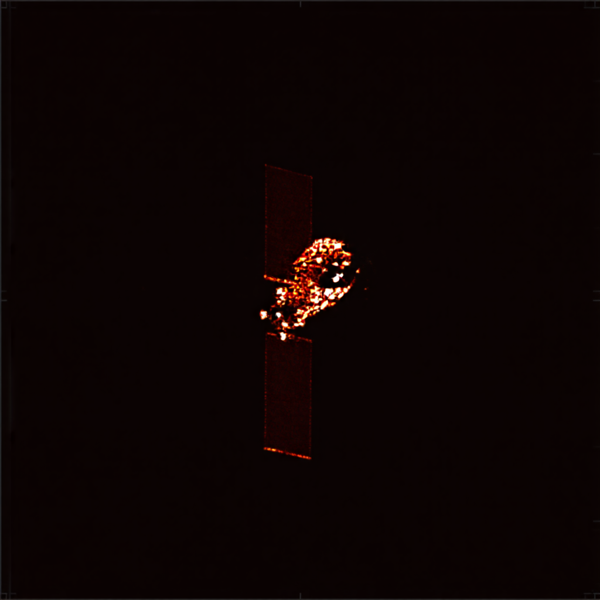

# 周报  

根据像素信息去定义残缺区域感觉效果不太好。

输入的isar原图

推理后的生成图

输入的isar原图

推理后的生成图

后续打算用SAM分割出翅膀和舱体，直接对翅膀使用之前那个大权重补全，舱体小权重补全。

对于TG就默认舱体是完整的，翅膀是残缺的，使用舱体的高光去拟合翅膀。

| 创新点                         | 作用和遇到的问题                                             |
| ------------------------------ | ------------------------------------------------------------ |
| 散点强度图作为“强散射中心聚焦” | 有散点分布的地方，拟合isar高光点                             |
| 翅膀和舱体的mask               | 目前还没有生成，后续生成出mask后验证是否可行                 |
| 二次残缺图                     | 因为TG的数据集只有舱体完整度高。目前的思路是对现有的舱体进行80%的残缺，然后使用二次残缺图对照原图完整的舱体训练，然后推理时使用原图作为残缺图进行补全。如果这个机制效果不好就不使用。 |

prompt = (

​    f"Inpaint and complete the missing parts of a simulated ISAR radar image of a satellite target. " # 强调补全任务

​    f"Guided by sparse scatter points and intensity map. " # 强调依赖散点

​    f"Generated via orthographic projection with a spatial resolution of {resolution:.4f} units/pixel. "

​    f"Image horizontal U-axis direction in 3D space is ({u_dir[0]:.4f}, {u_dir[1]:.4f}, {u_dir[2]:.4f}). "# 使用U轴和V轴定义卫星姿态

​    f"Image vertical V-axis direction in 3D space is ({v_dir[0]:.4f}, {v_dir[1]:.4f}, {v_dir[2]:.4f}). "

​    f"High contrast, black background."

  )

对于只用文本提示的生成模型，我觉得单次训练直接实现的效果肯定不好。打算用生成出来的图片和文本去训练一个扩散模型，只用文本提示即可生成，可作为下游任务。或者后续蒸馏出一个纯文本提示的模型。
