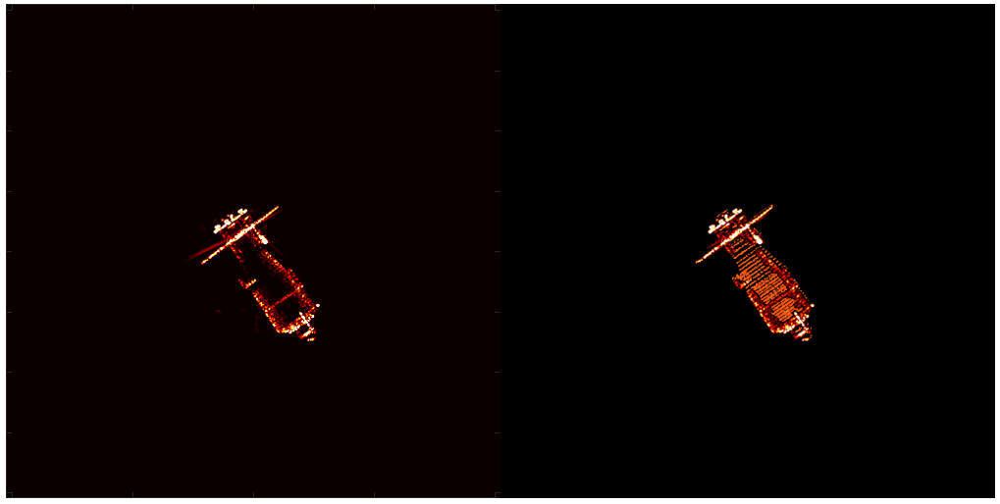
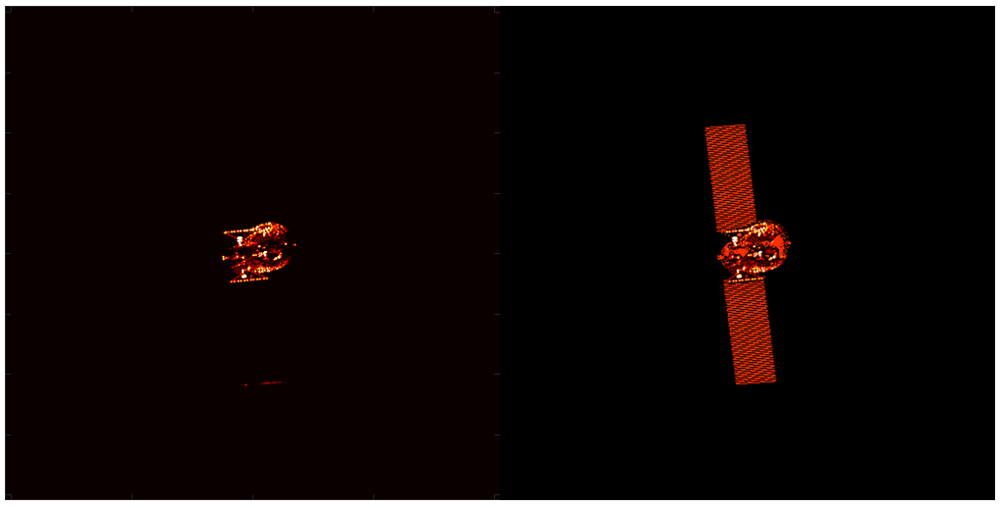
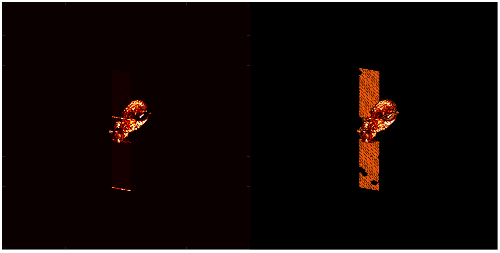
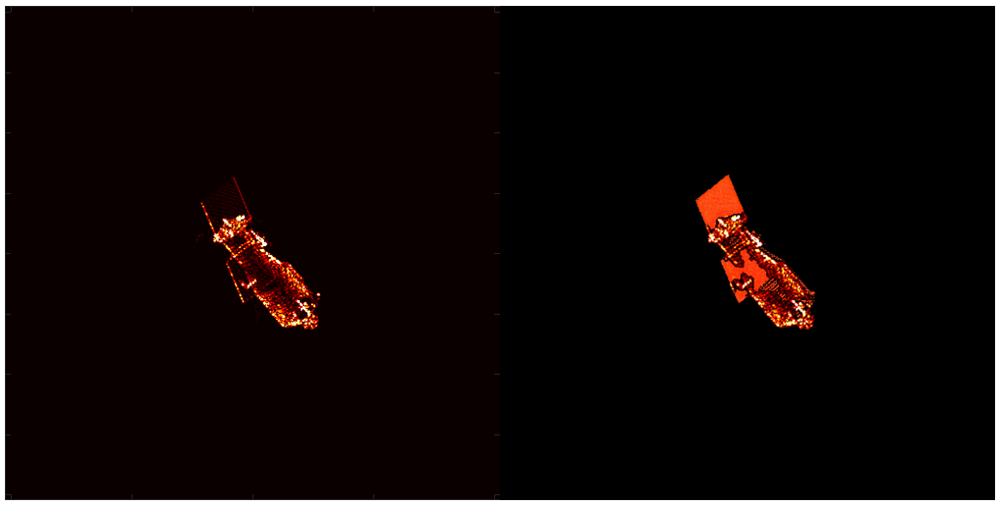

# 周报  

之前推理的时候用错方法了，现在用的方法是完整区域放原图，残缺区域进行补全，然后整合。

目前碰到的问题：

1.有些图片补全区域色彩与原图完整区域色彩有一些区别，我感觉是原图完整区域不够清楚，可以考虑对于完整区域进行数据增强，提高清晰度。

2.有些图片进行补全时可能区域丢失，先找一找原因再去解决。

评测对象与区域定义

- 评测图片数量：**321** 张。
- 控制图通道约定：**R 通道 = 散点强度图**，**G 通道 = 已知完整区域 mask**，**B 通道 = 完整卫星轮廓 mask**。
- 区域记号：**B** 表示完整轮廓区域，**G** 表示已知完整区域，**M = B - G** 表示需要补全的残缺区域。

| 指标              | 当前数据 | 简要含义                                                     |
| ----------------- | -------: | ------------------------------------------------------------ |
| `CR_missing`      |   0.6461 | 残缺区完整度。看 M 区域里有多少像素被结果图激活为有效前景。  |
| `SSC_M_IoU`       |   0.8949 | 残缺区散点位置 IoU。比较结果图散点位置和 R 通道散点支持位置的重合程度。 |
| `SSC_M_F1`        |   0.9440 | 残缺区散点 F1。综合 Precision 和 Recall。                    |
| `SSC_M_AreaRatio` |   0.8949 | 残缺区生成散点面积与 R 目标面积比例                          |
| `M_ShapeMAE`      |   0.0377 | 残缺区连续散点形状误差                                       |
| `M_ShapeSpearman` |   0.9563 | 残缺区散点强度排序相关性                                     |

我看其他论文用的指标

Masked Region Preservation：我们使用与人类感知一致的图像奖励(IR)[44]、HPS v2 (HPS)[41]和审美评分(AS)[34]。具体来说，ImageReward和HPS v2是文本到图像的人类偏好评估模型，该模型是在生成图像的人类偏好选择的大规模数据集上训练的。审美评分是一个基于真实图像质量评价对的线性模型。

Masked Region Preservation：我们在之前的工作中使用标准峰值信噪比(PSNR)[39]，习得感知图像补丁相似度(LPIPS)[52]和均方误差(MSE)[38]在生成图像和原始图像之间的未屏蔽区域。

Text Alignment：我们使用CLIP相似性(CLIP Sim)[40]来评估生成的图像和相应的文本提示之间的文本图像一致性。CLIP相似性使用CLIP模型[30]将文本和图像投影到相同的共享空间，并评估其嵌入的相似性。
