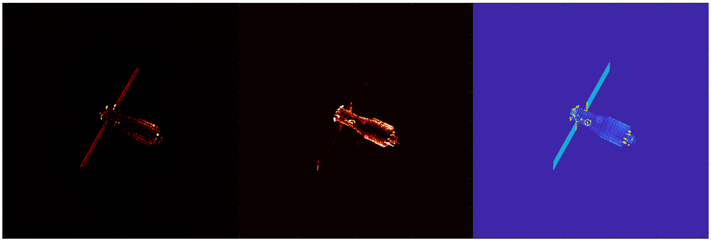
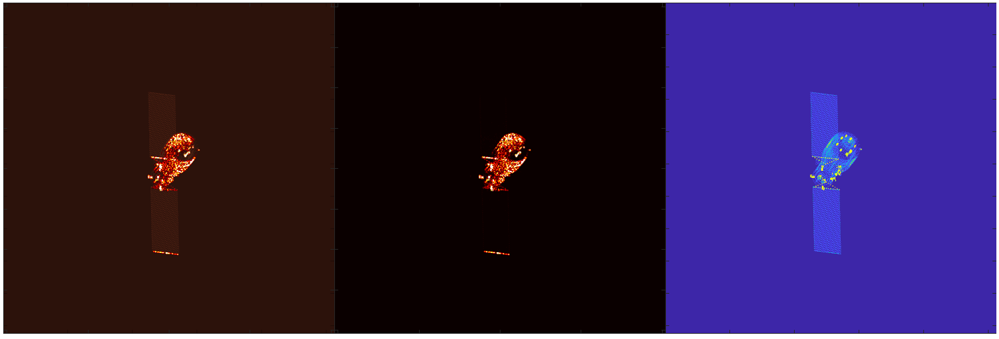

# 周报  

这个是不使用控制图去推理的效果。

有一个新的思路，先针对isar图和散点强度图进行RGB操作，得到一个较为完整的伪完整图。

最左边这个是用 ISAR 已知区域的平均颜色给散点上色。这个是处理后的初版，后续再把背景拉黑，再对完整区域和残缺区域的上色程度调整一下参数，应该可以得到较为完整的伪完整图。

得到较为完整的图之后再调整一下我现在的模型，用三分支结构，一个分支训练isar图的色彩信息，一个分支训练散点强度图的物理信息，一个分支训练UV坐标，然后蒸馏合并成UV坐标主分支。最终得到一个只使用UV坐标即可进行生成的模型。这几天试了一下这种三分支的结构，三个分支一起训练显存放不进去，现在想办法调整一下，用联级训练，先弄一个初版。

之前直接扩散模型训练，然后用UV坐标就可以生成对应的图片。所以理想情况下，有比较完整的伪完整图，就可以实现只用UV坐标即可生成对应的isar图片。

