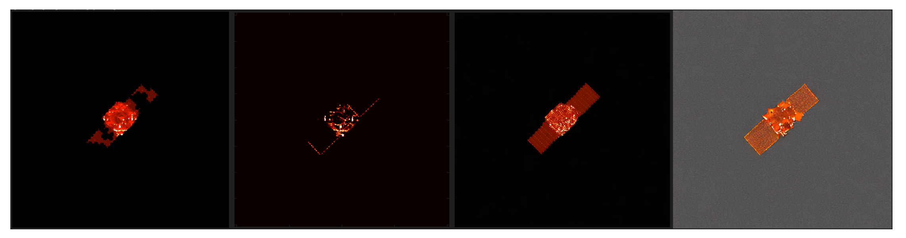
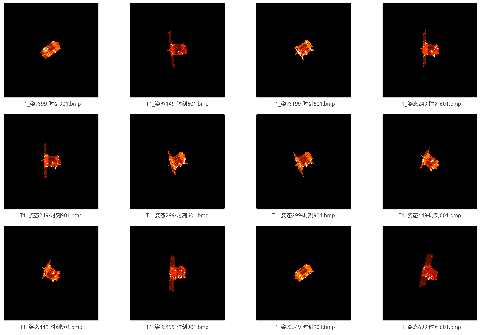
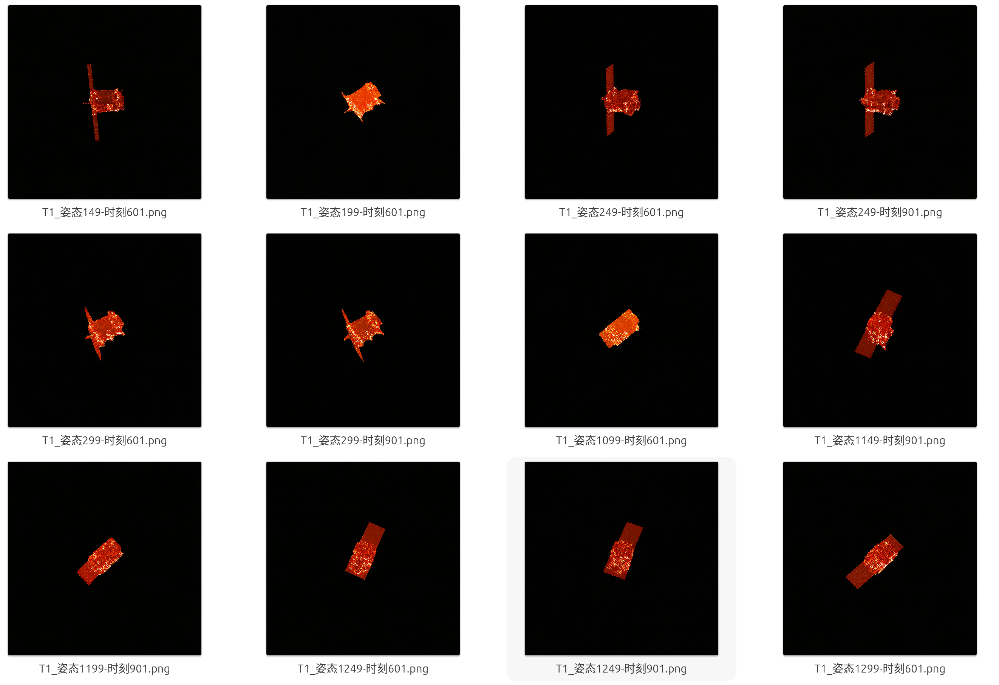

# 周报

跑了一个对比实验，Adding Conditional Control to Text-to-Image Diffusion Models（2023）这个论文，提出ControlNet的。

效果比较明显的比较图片。左1是推理图对应的伪完整图，左2是原残缺ISAR图，左3是我的推理结果，左4是Control原代码的推理结果。

调整了伪完整图，现在的伪完整图感觉差不多了。

这个是我的推理结果。

这个是Control的推理结果，效果很差，需要调整一下，尤其是背景。

这个指标还需要再找找论文调整一下，先再看看论文。

| 类别             | 指标                                                         | 方向                                                    |
| ---------------- | ------------------------------------------------------------ | ------------------------------------------------------- |
| 全参考重建质量   | `PSNR_full`, `SSIM_full`, `RMSE_full`, `MAE_full`            | PSNR/SSIM 越高越好，RMSE/MAE 越低越好                   |
| 缺失区域补全质量 | `PSNR_missing`, `SSIM_missing`, `RMSE_missing`, `MAE_missing` | 重点指标，专门评价补全部分                              |
| 已知区域保持     | `PSNR_known`, `SSIM_known`                                   | 越高越好，说明残缺 ISAR 已知部分没有被破坏              |
| 散射结构恢复     | `scatter_precision`, `scatter_recall`, `scatter_f1`, `scatter_iou` | 越高越好                                                |
| 位姿/结构偏移    | `centroid_error_px`                                          | 越低越好                                                |
| ISAR 聚焦与背景  | `pred_tbr`, `pred_contrast`, `pred_entropy`, `pred_snr_db`   | TBR/Contrast/SNR 越高越好，Entropy 越低通常表示聚焦更好 |
| 强度分布相似性   | `bhattacharyya_full`                                         | 越低越好                                                |

| Metric                   |      我的 | Control   |
| ------------------------ | --------: | --------- |
| `num_images`             |        70 | 152       |
| `mean_psnr_full`         | 28.023460 | 11.146457 |
| `mean_ssim_full`         |  0.800767 | 0.009161  |
| `mean_rmse_full`         |  0.039859 | 0.298739  |
| `mean_mae_full`          |  0.009330 | 0.292489  |
| `mean_psnr_missing`      | 15.991502 | 15.178799 |
| `mean_ssim_missing`      |  0.260027 | 0.172998  |
| `mean_scatter_f1`        |  0.952950 | 0.059693  |
| `mean_scatter_iou`       |  0.911691 | 0.030974  |
| `mean_centroid_error_px` |  1.379640 | 4.758083  |
| `mean_pred_tbr`          | 66.555456 | 1.704905  |
| `mean_pred_contrast`     |  9.624576 | 0.785483  |
| `mean_pred_entropy`      |  8.447483 | 12.293068 |