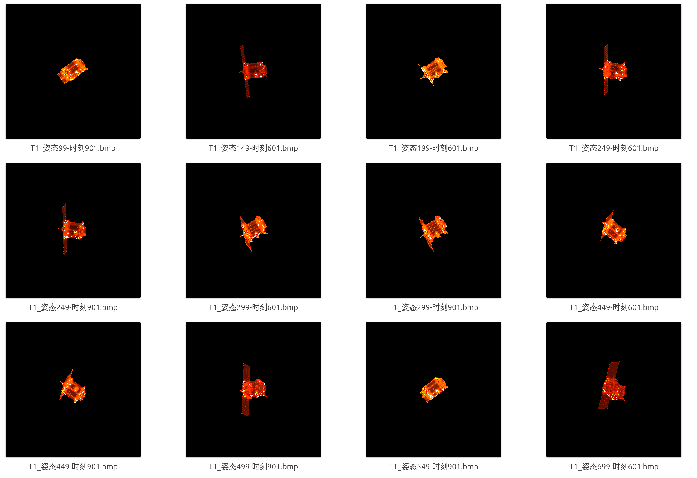
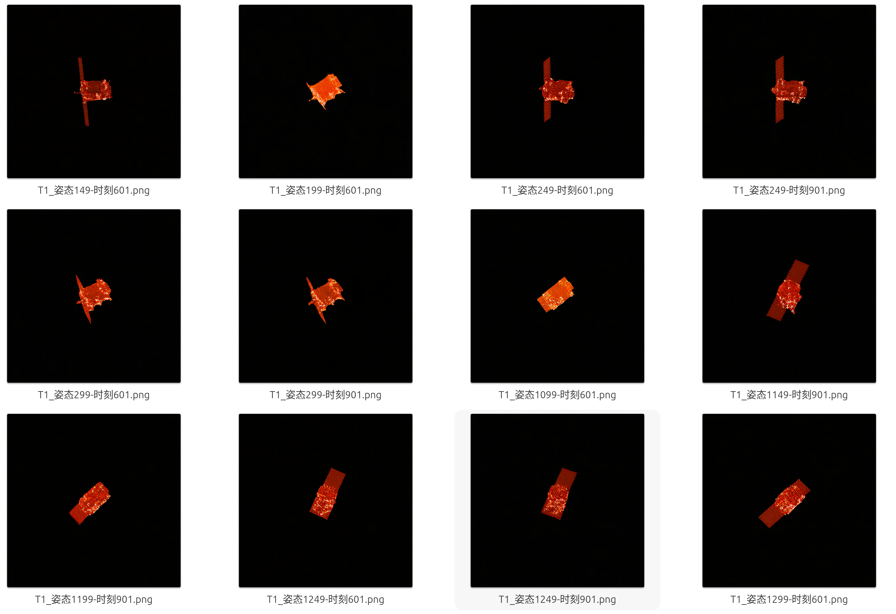
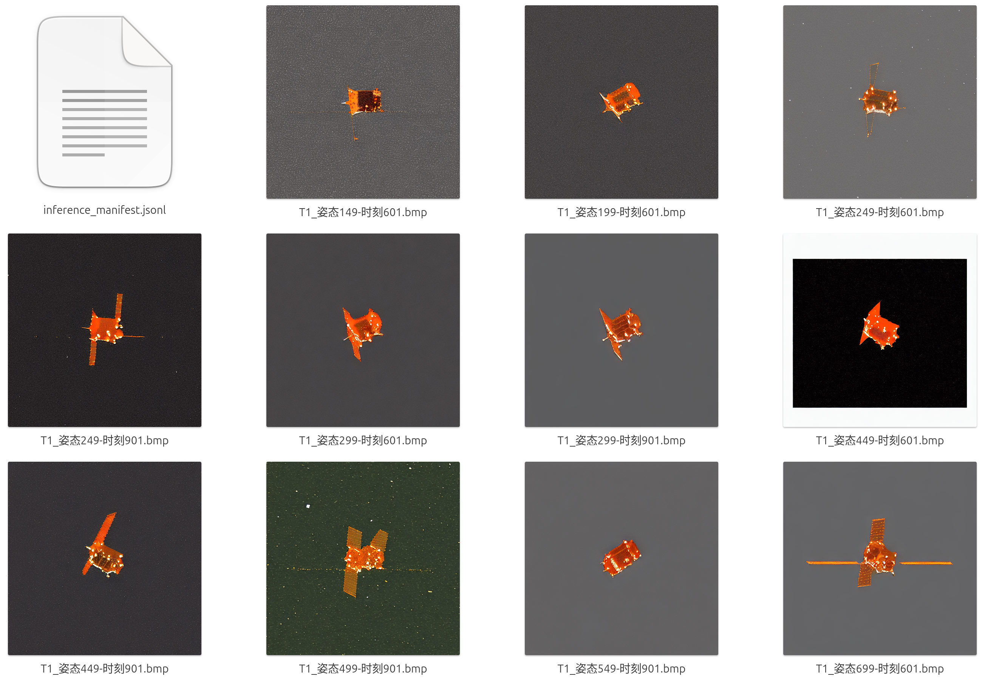
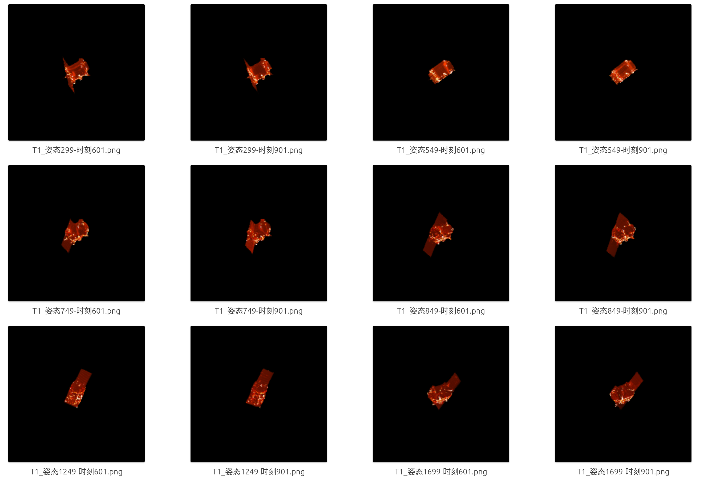

# 周报

跑了一个对比实验，RAD: Region-Aware Diffusion Models for Image Inpainting（2025）

伪完整图

我的推理结果

Control的推理结果，还需要调整一下。

RAD

这个指标是RAD代码里的指标，打算这几天把指标确定下来。RAD跑的时候用了八百多张，另外两个用了四百多张，RAD需要重新训练一次。

|            | mae    | mse    | psnr  |
| ---------- | ------ | ------ | ----- |
| 我的       | 0.0086 | 0.0019 | 26.99 |
| ControlNet | 0.23   | 0.07   | 11.5  |
| RAD        | 0.0037 | 0.0011 | 29.58 |

