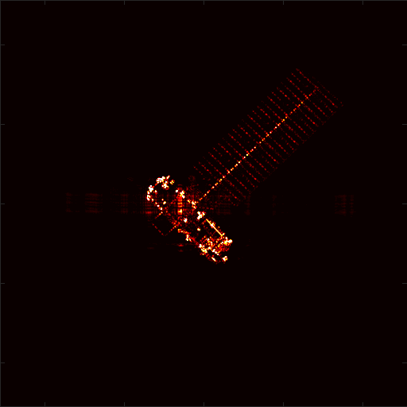

# 周报

## 大模型

qwen3.8在L40跑通了，整段分析的文字还需要调整。

【分析时间】：2026-08-27 19:09:02
【图像名称】：姿态1099-时刻1201-分辨率0.05.bmp
【图像尺寸】：512 × 512 像素

【isar_analysis_demo 多模型检测结果】
归一化图像熵：0.347578
聚焦状态：聚焦良好
聚焦综合分数：0.898970
目标区域像素数：24038
目标面积占比：0.091698
语义区域：cabin、solar_array
缺失语义部件：无
散射中心数量：47
连通域数量：2
显著连通域数量：2
最大连通域占比：0.975248
碎片化指数：0.024752
非噪声区域占比：1.000000
语义完整度：1.000000
部件关系正交度：0.407625
拓扑综合分数：0.851906
拓扑状态：结构完整正交
完整指标文件：/home/lcwt/SSD2/LargeModel/LargeModel/output/isar_features/1099-_1201-_0_05_20260827_190833_2bfcaf8f/1099-_1201-_0.05__38f33b67/all_metrics.json

【Qwen3.8 图像分析】
该幅ISAR图像已经过上游多模型联合分析。目标区域归一化图像熵为0.3476，目标区域灰度分布较集中，信息丰富度相对有限；聚焦状态判定为聚焦良好，聚焦综合分数为0.8990，主要散射响应较集中，主体结构具备较好的判读条件。语义分割得到的目标区域包含24038个像素，约占整图9.17%，当前识别到的语义部件为主体舱、太阳翼，未发现预期语义部件缺失。图中提取出47个散射中心和2个连通域，其中显著连通域2个，最大连通域占比为0.9752，碎片化指数为0.0248。拓扑综合分数为0.8519，语义完整度为1.0000，部件关系正交度为0.4076，拓扑状态判定为结构完整正交，主要语义部件及其空间关系完整清晰。综合来看，可用于主体结构、散射分布和成像质量的辅助判读，精确尺寸与姿态仍需专用算法确认。

## 实验

跑了两个前几年gan的baseline，lama和MI-GAN。下周跑一下流匹配和消融，然后写到word上一边跑实验一边写中文稿。

伪完整图

我的推理结果

Control的推理结果，还需要调整一下。

RAD（颜色偏暗）

lama（目前效果最好）

MI-GAN（部分结果依旧有水平噪声）

|            | mae      | mse     | psnr   |
| ---------- | -------- | ------- | ------ |
| 我的       | 0.0086   | 0.0019  | 26.99  |
| ControlNet | 0.23     | 0.07    | 11.5   |
| RAD        | 0.00641  | 0.00269 | 25.694 |
| lama       | 0.003398 | 0.00093 | 30.313 |
| MI-GAN     | 0.01667  | 0.00212 | 26.730 |

有个问题，lama的效果比我的好一些，然后我的效果比其他的指标没有拉开很多。先看看消融，需要提升一下我的效果。

我的评价指标是根据伪完整图去计算的，但是有些伪完整图并不是完全完整。在没有真值的情况下，使用伪完整图去评价可以吗？
