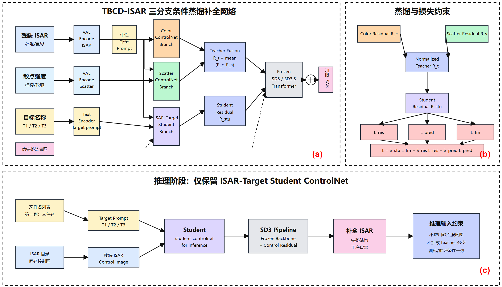

# 周报

# **3 实验结果与分析**

## **A. 实验设置与评价指标**

### **1) 数据集与实施方法**

本文采用自建仿真 ISAR 数据开展残缺图像补全实验。样本由残缺 ISAR 图像、散点强度图及伪完整监督图构成，并通过文件名建立对应关系。其中，残缺 ISAR 图像提供已知散射区域的外观信息，散点强度图用于构造伪完整监督及训练结构教师分支。本节分别报告方法对比与消融实验，消融测试集组成及区域评价口径在 C 节说明。

TBCD-ISAR 以 SD3.5-Medium 为生成主干，冻结 VAE、文本编码器和 MMDiT Transformer，仅训练 ControlNet 条件分支。训练依次包括外观分支预训练、结构分支预训练、ISAR学生分支预训练及教师—学生蒸馏四个阶段，并采用 bf16 混合精度、梯度检查点和分阶段显存卸载策略。推理阶段仅使用学生分支，以残缺 ISAR 图像和 目标名提示为输入，无需额外提供散点强度图。

### **2) 评价指标**

方法对比采用平均绝对误差（MAE）、均方误差（MSE）和峰值信噪比（PSNR）。MAE 衡量平均像素偏差，MSE 对较大误差更敏感，PSNR 从信噪比角度反映重建质量，单位为 dB。消融实验进一步报告结构相似性（SSIM）、学习感知图像块相似度（LPIPS）及 Fréchet Inception Distance（FID），分别补充结构、感知差异及图像集合特征分布的评价。MAE、MSE、LPIPS 和 FID 越低越好，PSNR 和 SSIM 越高越好；这些指标反映的质量维度不同，应结合区域结果共同解释。

## **B. 对比实验结果与分析**

### **1) 对比方法**

本文将 TBCD-ISAR 与 ControlNet、RAD、LaMa、MI-GAN、DeltaFM 和 Flow Matching 六种方法进行比较，涵盖空间条件控制、扩散补全、频域卷积补全、轻量化对抗生成及流匹配等技术路线。ControlNet 通过零初始化卷积将空间条件接入预训练扩散模型；RAD 采用逐像素噪声调度，使不同区域在全局上下文约束下异步生成。两者分别为分析条件控制与区域建模提供参照。

LaMa 通过快速傅里叶卷积扩大感受野，并结合高感受野感知损失和大掩膜训练进行图像补全；MI-GAN 面向移动端补全任务，结合对抗训练、模型重参数化和知识蒸馏实现轻量化建模。Flow Matching 通过学习连接源分布与目标分布的速度场实现生成；DeltaFM 在流匹配目标中引入对比约束，以增强不同条件下生成流的区分性。上述方法的原始任务及条件形式存在差异，本节比较的是其在当前 ISAR 补全实验中的实现结果。

### **2) 定量结果**

表 I  不同方法在自建 ISAR 补全数据集上的定量对比结果

**（检查了一下，有些实验使用mask进行训练推理，没有和我的数据完全统一）**

| **方法**                            | **MAE ↓**  | **MSE ↓**  | **PSNR ↑ (dB)** |
| ----------------------------------- | ---------- | ---------- | --------------- |
| ControlNet                          | 0.23       | 0.07       | 11.5            |
| RAD                                 | 0.0064     | 0.0026     | 25.69           |
| **LaMa**                            | **0.0033** | **0.0009** | **30.31**       |
| MI-GAN                              | 0.0166     | 0.0021     | 26.73           |
| DeltaFM（效果很差应该是实验有问题） | 0.4966     | 0.3744     | 4.266           |
| Flow Matching                       | 0.0159     | 0.0013     | 28.85           |
| **TBCD-ISAR（本文）**               | **0.0086** | **0.0019** | **26.99**       |

表 I 给出了各方法的定量结果。TBCD-ISAR 的 MAE、MSE 和 PSNR 分别为 0.0086、0.0019 和 26.99 dB，在七种方法中三项指标均排名第三。其中，MAE 仅高于 LaMa 和 RAD，MSE 与 PSNR 则次于 LaMa 和 Flow Matching。这表明本文方法在当前实验中具有一定的像素重建竞争力，但尚未在所有指标上达到最优。

与 ControlNet 相比，TBCD-ISAR 的 MAE 由 0.23 降至 0.0086，MSE 由 0.07 降至 0.0019，PSNR 由 11.5 dB 提升至 26.99 dB，增加 15.49 dB。该结果表明，本文完整方案在当前实验配置下取得了优于 ControlNet 对比实现的重建表现。由于本文同时引入伪完整监督、多分支条件学习和教师—学生蒸馏，整体对比尚不能区分各项设计的独立贡献，下文通过消融实验进一步分析蒸馏损失与学生预训练的作用。

与 MI-GAN 相比，本文方法的 MAE 和 MSE 分别降低约 48.19% 和 9.52%，PSNR 提高 0.26 dB，在三项指标上均有改善。与 RAD 相比，本文方法的 MAE 增加 0.0022，而 MSE 降低约 26.92%，PSNR 提高 1.30 dB，说明两种方法在不同误差度量下各有优势。与 Flow Matching 相比，本文方法的 MAE 降低约 45.91%，但 MSE 增加 0.0006，PSNR 降低 1.86 dB。这种指标排序差异说明，平均绝对偏差的降低并不必然伴随平方误差的同步降低，仅凭单项指标不足以判断整体重建质量。

LaMa 在当前比较中取得最优结果，其 MAE、MSE 和 PSNR 分别为 0.0033、0.0009 和 30.31 dB。相较之下，本文方法的 MAE 和 MSE 分别高出 0.0053 和 0.0010，PSNR 低 3.32 dB，表明像素一致性仍有改进空间。DeltaFM 在本实验中的三项指标分别为 0.4966、0.3744 和 4.266 dB，整体低于本文方法；这一结果仅反映当前实现及评估条件下的表现，不能据此推断对比流匹配目标本身不适用于 ISAR 补全。

综合来看，TBCD-ISAR 在三项指标上均优于 ControlNet、MI-GAN 和 DeltaFM，与 RAD、Flow Matching 相比则呈现不同的性能取舍。对于稀疏散射、背景接近黑色的 ISAR 图像，像素误差需要结合其空间分布进行解释；现有定量结果尚不足以单独证明缺失散射区域恢复、背景抑制或 UV 位姿对齐的优势。本文方法在推理时不依赖散点强度图，下文通过区域指标和消融变体进一步分析整体结构一致性与局部像素误差之间的关系。

## **C. 消融实验**

### **1) 实验设置与区域评价**

本组消融实验将训练与推理随机种子均固定为 42，测试集包含 409 张图像，其中 T1、T2 和 T3 分别为 161、87 和 161 张。五个变体使用相同测试样本、推理参数和评价程序。

A0 为完整模型，同时使用学生监督、残差蒸馏和预测蒸馏，并进行 Stage 3 学生预训练；A1 移除全部蒸馏，仅保留学生监督；A2 移除残差蒸馏；A3 移除预测蒸馏；A4 取消 Stage 3 学生预训练，从 Stage 2 权重开始训练。

评价区域包括全图（Full）、目标区域（Object）、待补全区域（Fill）、已知区域（Known）及目标外区域（Outside-object）。Full、Object 和 Fill 以根据散点强度轮廓构造的伪完整监督图 pseudo_target 为参考；Known 与 Outside-object 以残缺 ISAR 条件图为参考。因此，本组结果衡量的是与相应参考图的数值或特征一致性，不能直接等同于真实完整 ISAR 的恢复精度。推理评价使用模型原始输出，未将已知区域像素显式覆盖回生成图像。

### **2) 整体蒸馏与全图评价**

表 II  不同消融变体的全图结构与感知评价结果

A0 为完整模型，同时使用学生监督、残差蒸馏和预测蒸馏，并进行 Stage 3 学生预训练；

A1 移除全部蒸馏，仅保留学生监督；

A2 移除残差蒸馏；

A3 移除预测蒸馏；

| **变体** | **Full MAE ↓** | **Full PSNR ↑** | **SSIM ↑**   | **LPIPS ↓**  | **FID ↓**   |
| -------- | -------------- | --------------- | ------------ | ------------ | ----------- |
| A0       | **0.008462**   | 26.8175         | **0.832818** | 0.024331     | **52.5599** |
| A1       | 0.010272       | 26.8014         | 0.735523     | 0.024032     | 69.7045     |
| A2       | 0.010134       | **26.8276**     | 0.739422     | **0.023670** | 59.9620     |
| A3       | 0.008851       | 26.7780         | 0.812275     | 0.024115     | 54.6240     |
| A4       | 0.008966       | 26.4140         | 0.823870     | 0.026784     | 53.3561     |

注：粗体表示本表各项指标的最优值，PSNR 单位为 dB。

如表 II 所示，A0 在 Full MAE、SSIM 和 FID 上取得本组最优值，分别为 0.008462、0.832818 和 52.5599。与无蒸馏的 A1 相比，A0 的 Full MAE 降低约 17.62%，SSIM 提高 0.097295，FID 降低 17.1446，表明在当前单种子实验中，完整蒸馏有利于全图结构及特征分布的一致性。不过，A0 的 LPIPS 比 A1 高 0.000299，Full PSNR 也并非本组最高，因此不能将这一收益概括为所有感知或重建指标均得到改善。

移除残差蒸馏后，A2 的 SSIM 降至 0.739422，FID 升至 59.9620，Full MAE 升至 0.010134；同时，A2 取得最高 Full PSNR 和最低 LPIPS。移除预测蒸馏后，A3 的 Full MAE、Full PSNR、SSIM 和 FID 均弱于 A0，但 LPIPS 略优。这表明两类蒸馏约束的贡献具有指标依赖性，需要结合目标区域及补全区域误差进一步判断。

### **3) 区域误差与学生预训练分析**

评价区域包括全图（Full）、目标区域（Object）、待补全区域（Fill）、已知区域（Known）及目标外区域（Outside-object）。Full、Object 和 Fill 以根据散点强度轮廓构造的伪完整监督图 pseudo_target 为参考；Known 与 Outside-object 以残缺 ISAR 条件图为参考。

表 III  不同消融变体的区域评价结果

| **变体** | **Fill**** ****MAE ↓** | **Fill**** ****PSNR ↑** | **Object**** ****MAE ↓** | **Object**** ****PSNR ↑** | **Known**** ****MAE ↓** | **Outside**** ****MSE ↓** |
| -------- | ---------------------- | ----------------------- | ------------------------ | ------------------------- | ----------------------- | ------------------------- |
| A0       | 0.098750               | 14.8313                 | 0.123680                 | 12.8492                   | 0.281814                | 0.000843                  |
| A1       | **0.098025**           | **14.9211**             | **0.122936**             | **12.9094**               | 0.280948                | 0.000813                  |
| A2       | 0.098101               | 14.8802                 | 0.122964                 | 12.8903                   | **0.280674**            | **0.000797**              |
| A3       | 0.099098               | 14.7811                 | 0.123909                 | 12.8143                   | 0.281290                | 0.000838                  |
| A4       | 0.102137               | 14.5712                 | 0.127747                 | 12.6151                   | 0.290197                | 0.000910                  |

注：粗体表示本表各项指标的最优值，PSNR 单位为 dB。

表 III 显示，A1 的 Fill MAE、Fill PSNR、Object MAE 和 Object PSNR 均为最优，A2 则取得最低 Known MAE 和 Outside MSE。与 A1 相比，A0 的 Fill MAE 高 0.000725，增幅约 0.74%，Fill PSNR 低 0.0898 dB。因此，完整蒸馏在全图结构评价上的优势并未同步体现为补全区域逐像素误差的降低。由于目标区域仅占全图较小比例，全图指标易受大面积背景影响，补全能力应重点结合 Fill 和 Object 的结果分析。

与 A2 相比，加入残差蒸馏的 A0 虽然改善了 Full MAE、SSIM 和 FID，但 Fill MAE 从 0.098101 升至 0.098750，LPIPS 从 0.023670 升至 0.024331，Outside MSE 从 0.000797 升至 0.000843。当前结果说明，残差蒸馏体现出全图结构一致性与局部像素误差之间的取舍，尚不能证明其对补全区域精度或背景保持具有一致的正向作用。

与 A3 相比，保留预测蒸馏的 A0 将 Fill MAE 从 0.099098 降至 0.098750，降幅约 0.35%，Fill PSNR 提高 0.0502 dB；Object MAE 和 Object PSNR 也有所改善。结合表 II 中 SSIM 和 FID 的改善，预测蒸馏在本次实验中对补全区域及全图结构评价表现出正向作用。但 A0 的 Known MAE 和 Outside MSE 均略高于 A3，且部分差异幅度较小，不能据此认定为稳定的全面增益。

学生预训练的收益较为一致。相较于未进行 Stage 3 预训练的 A4，A0 的 Fill MAE 降低约 3.32%，Object MAE 降低约 3.18%，对应 PSNR 分别提高 0.2601 dB 和 0.2341 dB；Full MAE 降低约 5.62%，LPIPS 降低约 9.16%。同时，Known MAE 与 Outside MSE 均有所下降，表 II 和表 III 所列指标全部改善。这支持在教师—学生蒸馏前进行学生直接监督预训练，有助于改善当前配置下的条件补全表现。

### **4) 分目标结果与讨论**

表 IV  不同目标组的 Fill 区域评价结果

| **变体** | **T1**** ****MAE ↓** | **T1**** ****PSNR ↑** | **T2**** ****MAE ↓** | **T2**** ****PSNR ↑** | **T3**** ****MAE ↓** | **T3**** ****PSNR ↑** |
| -------- | -------------------- | --------------------- | -------------------- | --------------------- | -------------------- | --------------------- |
| A0       | 0.094726             | 15.0149               | **0.080500**         | **16.1722**           | 0.117962             | 13.8089               |
| A1       | 0.096246             | 14.9530               | 0.082362             | 16.0876               | **0.113129**         | **14.0894**           |
| A2       | **0.094477**         | **15.0457**           | 0.081331             | 16.1145               | 0.115695             | 13.9242               |
| A3       | 0.095162             | 14.9152               | 0.080992             | 16.1287               | 0.118110             | 13.7865               |
| A4       | 0.098066             | 14.7495               | 0.082240             | 15.9919               | 0.122821             | 13.5122               |

注：粗体表示本表各项指标的最优值，PSNR 单位为 dB。

如表 IV 所示，三个目标组对蒸馏的响应不同。A0 在 T2 上取得最优 Fill MAE 和 PSNR，A2 在 T1 上最优，A1 在 T3 上最优。相较于 A1，A0 的 Fill MAE 在 T1 和 T2 上分别降低 0.001520 和 0.001862，却在 T3 上增加 0.004833，说明蒸馏的补全区域像素收益存在目标组差异，T3 的性能下降抵消了其在另外两组上的改善。T3 在各变体中均具有更高的 Fill MAE 和更低的 PSNR，其与伪监督的一致性仍有较大改进空间。

在 T1、T2 和 T3 上，A0 的 Fill MAE 均低于 A3 和 A4，PSNR 均高于二者，说明预测蒸馏及学生预训练的收益在本次实验的三个目标组中方向一致。其中，学生预训练相对于 A4 的改善幅度更大。残差蒸馏则未表现出相同规律：A0 仅在 T2 的 Fill 指标上优于 A2，在 T1 和 T3 上均略弱，进一步说明其局部像素收益具有目标组依赖性。

此外，各变体的 Known MAE 均处于 0.280674 至 0.290197 之间，表明原始生成输出与已知区域参考像素仍存在偏差；当前方法不能描述为对可信像素实施了硬性保留。由于 Known 与 Fill 使用不同参考图，不能仅根据二者数值大小直接比较恢复难度。LPIPS 与 FID 基于自然图像预训练特征，本组仅包含 409 张雷达图像，因此将其作为补充证据。当前实验只有 seed 42 的单次结果，尚无跨种子均值、标准差或显著性检验，小幅差异仍需进一步验证。

综上，本组消融结果支持完整蒸馏改善全图结构与特征分布一致性，但不支持其全面降低补全区域像素误差。预测蒸馏在三个目标组的 Fill 指标上呈现小幅一致收益，学生预训练在本组所列指标上表现出更一致的改善；残差蒸馏则体现了全图结构评价与局部像素误差的权衡。上述结论限于当前伪监督、测试样本及单随机种子设置，尚不能替代真实完整 ISAR 参考或多次重复实验下的验证。
